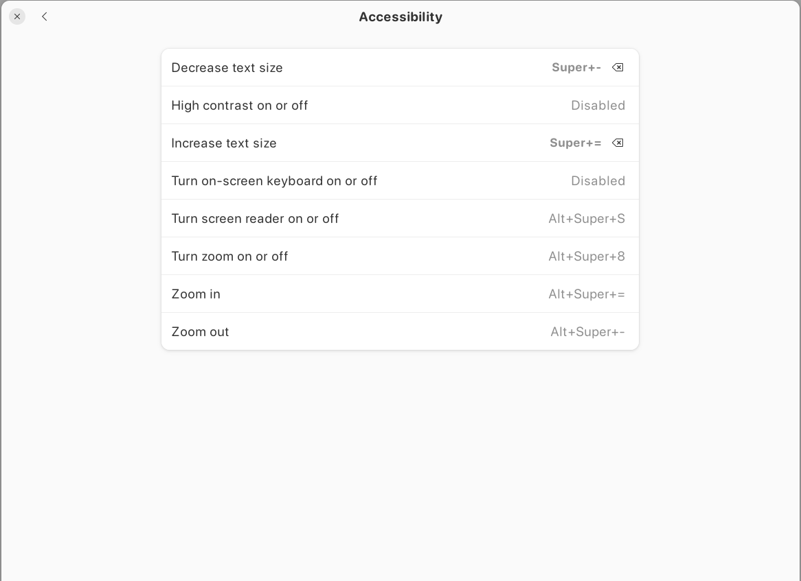

# Ubuntu Keyboard Shortcuts

**Settings >> Keyboard >> View and Customize Shortcuts**

## Accesibility

## Launchers

## Navigation

## Screenshots

## Sound And Media

## System

## Typing

## Windows

## Custom Shortcuts

## Custom: MongoDB Compass

## Custom: Postman

## Custom: Virtual Box

## Custom: VS Code

