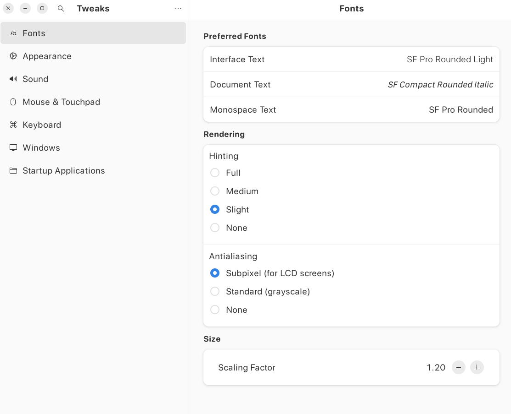
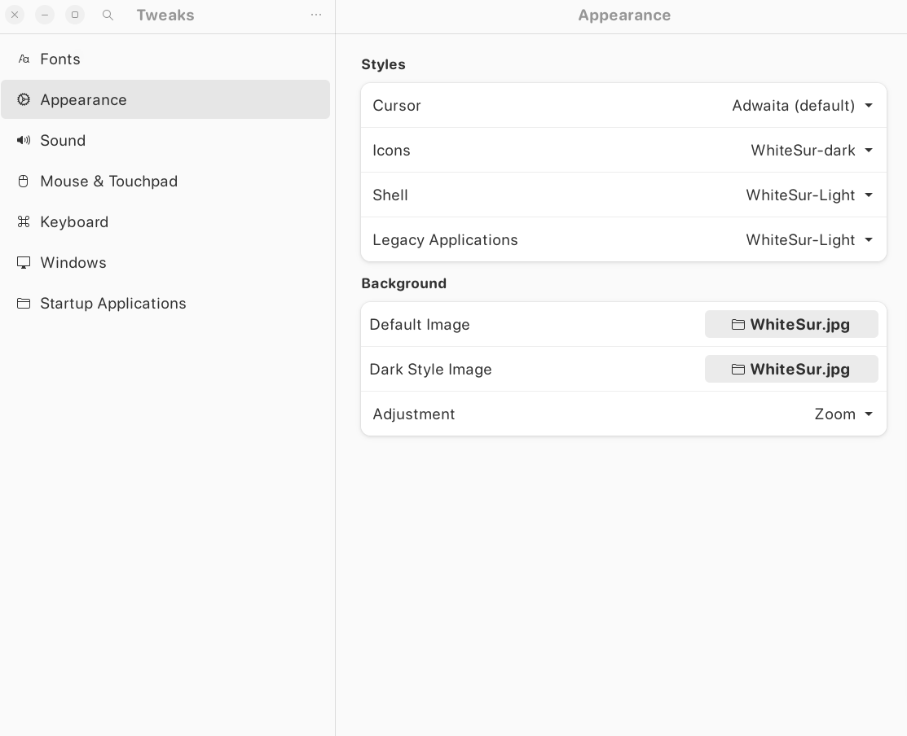

# Make Ubuntu Look Like MacOS

## Set Up Resources

[YouTube Video](https://www.youtube.com/watch?v=EMrNBMCaQFA)

[GitHub: Vince Liuice](https://github.com/vinceliuice/WhiteSur-gtk-theme?tab=readme-ov-file)

## Steps

1. **Settings >> Appearance >> Dock**
- 

2. ### Open: Terminal

```bash
sudo apt update && sudo apt upgrade -y
sudo apt install gnome-tweaks gnome-shell-extensions gnome-shell-extension-manager -y
```

3. ### Open: Extensions Manager

> **Note:** Some apps may need to be installed: Go to `Browse` tab and search for missing apps.


4. ### Clone

[WhiteSur GTK Theme](https://github.com/vinceliuice/WhiteSur-gtk-theme)

```bash
git clone git@github.com:vinceliuice/WhiteSur-gtk-theme.git
git clone git@github.com:vinceliuice/WhiteSur-icon-theme.git
git clone git@github.com:vinceliuice/WhiteSur-wallpapers.git
```

5. ### `cd` into WhiteSur GTK Theme directory

Inside the WhiteSur GTK Theme directory, install all the themes [optional], look into the WhiteSur GTK Theme [README.md](https://github.com/vinceliuice/WhiteSur-gtk-theme/blob/master/README.md) for more installation guides.

> **Tip:** The `-N glassy` option makes `Ubuntu's Nautilus File Manager` glassy like

```bash
cd WhiteSur-gtk-theme/
./install.sh -t all -N glassy
```

6. ### Tweak it!!

Time to modify Ubuntu!!

```bash
sudo ./tweaks.sh
```

7. ### `cd` into WhiteSur Icon Theme directory

```bash
cd WhiteSur-icon-theme/
./install.sh
```

8. ### Set The Wallpapers [Optional]

Set the wallpaper of your choice.

[Wallpapers](wallpapers/)

```bash
└── wallpapers
    └── MacOS
        ├── 1080p
        ├── 2k
        └── 4k
```

9. ### Tweak it!!!

**Open: Tweaks**

**Set as follows.**

[Fonts](fonts/)




