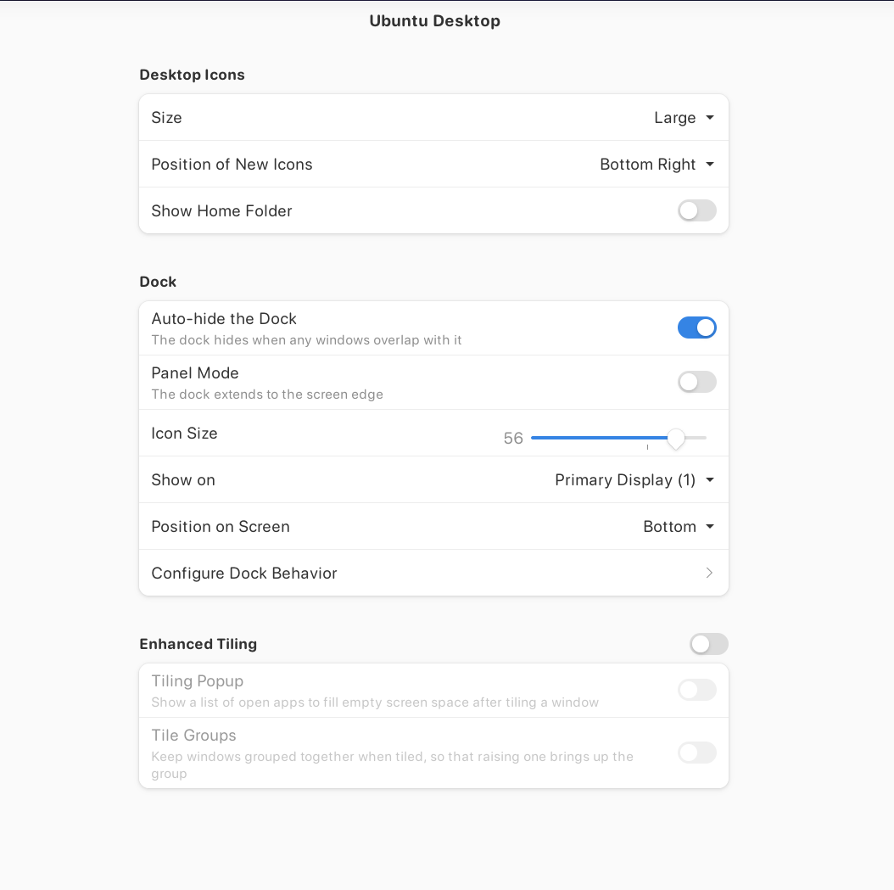
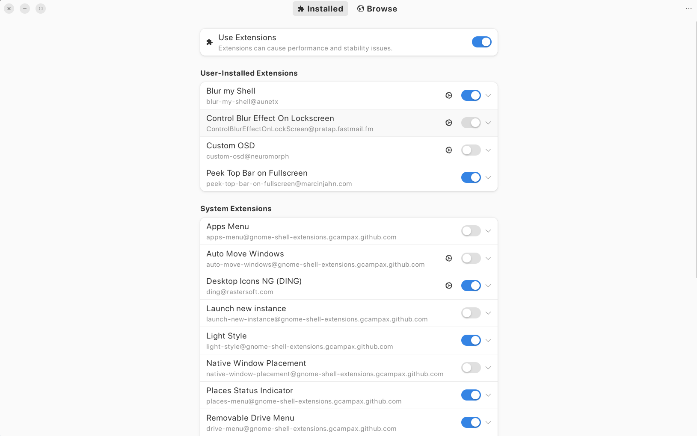
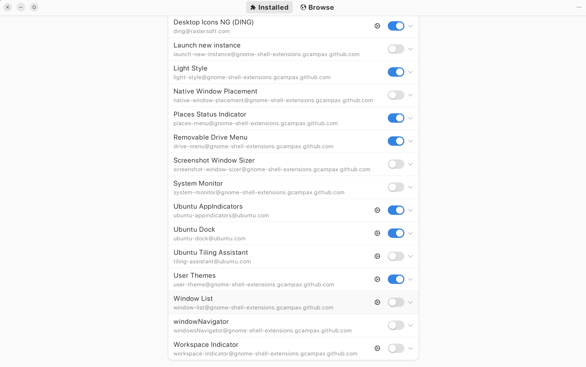

# Make Ubuntu Look Like MacOS

## Set Up Resources

[YouTube Video](https://www.youtube.com/watch?v=EMrNBMCaQFA)

[GitHub: vince Liuice](https://github.com/vinceliuice/WhiteSur-gtk-theme?tab=readme-ov-file)

## Steps

1. **Settings >> Appearance >> Dock**
- 

2. ### Open: Terminal

```bash
sudo apt update && sudo apt upgrade -y
sudo apt install gnome-tweaks gnome-shell-extensions gnome-shell-extension-manager -y
```

3. ### Open: Extensions Manager

> **Note:** Some apps may need to be installed: Go to `Browse` tab and search for missing apps.




