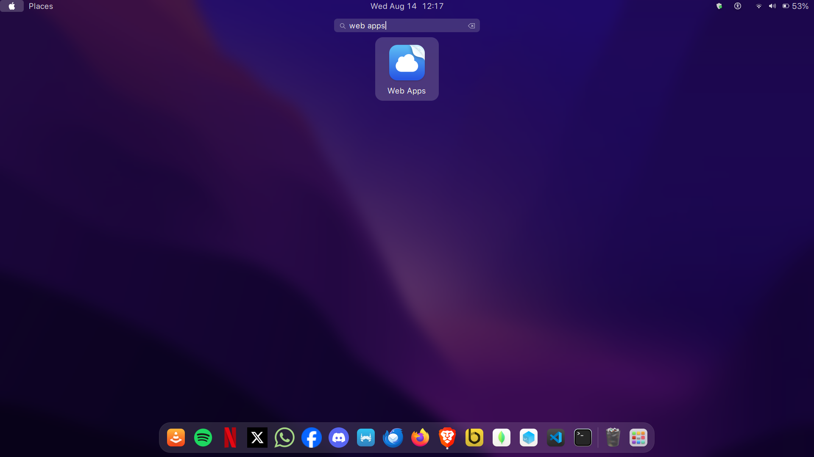
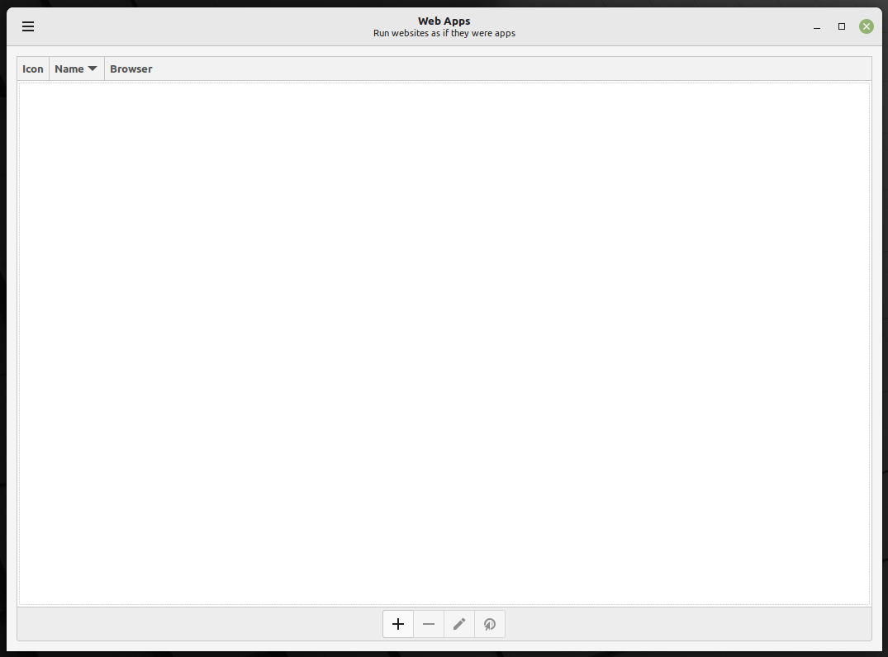
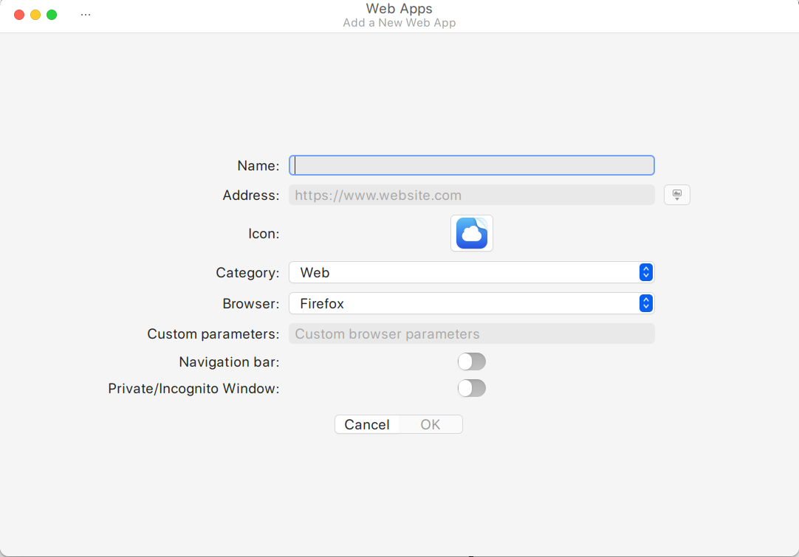
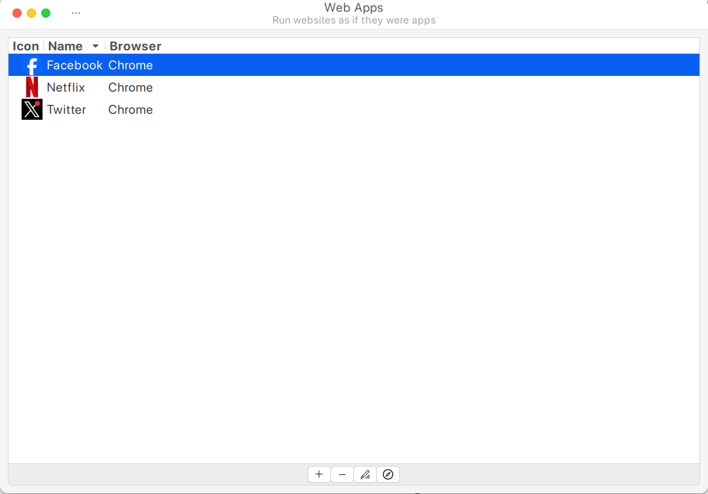
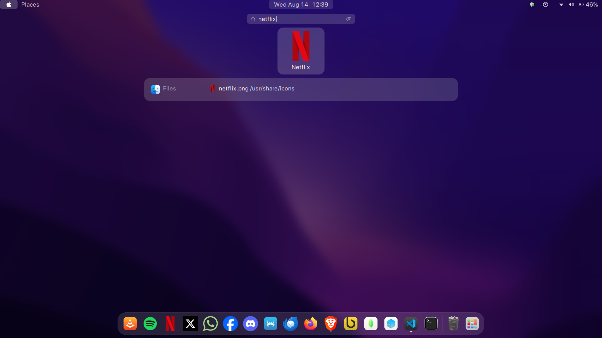

# How To Set Web Apps On Ubuntu: Web App Manager

## Table of Content
- [Author](#author)
- [Description](#description)
- [Installation](#installation)
- [Set Up](#set-up)

# Description

This detailed guide will help you understand what a Webapp is, its advantages, difference between the traditional apps and webapps, and finally how to easily install webapps using [Webapp Manager](http://packages.linuxmint.com/pool/main/w/webapp-manager/) `**NB: Unsecure site**` tool on your Linux computer.

## Installation

**Sites:**

- [OS Technix](https://ostechnix.com/linux-mint-webapp-manager/)

- [Download Webapp Manager .deb file](http://packages.linuxmint.com/search.php?release=any%C2%A7ion=any&keyword=webapp-manager)

```bash
cd ~
wget http://packages.linuxmint.com/pool/main/w/webapp-manager/webapp-manager_1.3.7_all.deb
sudo apt install gdebi
sudo gdebi webapp-manager_1.3.7_all.deb
```

## Set Up

### Convert Webapps into Standalone Apps using Webapp Manager

**To install any webapps using Webapp Manager, follow the steps below.**

#### Creating a Web App

**Launch the Webapp Manager from the Dash or menu:**

**Search Web App:**


___

**This is how the default interface of Webapp Manager looks like.**


___

**Creating, Adding, Modifying Apps**

In the Webapp Manager application window, click the plus (+) icon or `ctrl+N` and enter the URL of the website you want to turn into an app.

You can also customize the web app by adjusting the different settings . For instance, you can set the icon for your web app, the default browser to open that app (E.g. Firefox or Google Chrome), category of the web app (E.g. Website or Office), and enable or disable navigation bars and incognito window etc.

Once you entered all the details, click the OK button.


___

**Accessing Web Apps**

Once created, these web apps can be accessed either from the Webapp Manager interface itself or from the system's application menu, just like any other installed software.

> **From Webapp Manager Menu:**



> **From System's Application Menu:**



**Apps can be pinned to the dock as well:**

> To pin the app: Just pin as you would with any other apps.


## Author

**Tafara Nyamhunga  - [Github](https://github.com/tafara-n) / [Twitter](https://twitter.com/tafaranyamhunga)**
